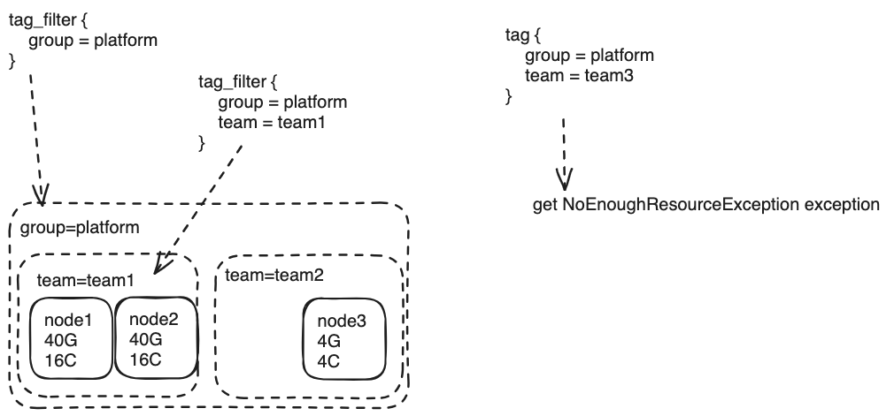

# 资源隔离

在2.3.6版本之后, SeaTunnel支持对每个实例添加`tag`, 然后在提交任务时可以在配置文件中使用`tag_filter`来选择任务将要运行的节点.

## 如何实现改功能

1. 更新`hazelcast.yaml`文件

```yaml
hazelcast:
  cluster-name: seatunnel
  network:
    rest-api:
      enabled: true
      endpoint-groups:
        CLUSTER_WRITE:
          enabled: true
        DATA:
          enabled: true
    join:
      tcp-ip:
        enabled: true
        member-list:
          - localhost
    port:
      auto-increment: false
      port: 5801
  properties:
    hazelcast.invocation.max.retry.count: 20
    hazelcast.tcp.join.port.try.count: 30
    hazelcast.logging.type: log4j2
    hazelcast.operation.generic.thread.count: 50
  member-attributes:
    group:
      type: string
      value: platform
    team:
      type: string
      value: team1
```

在这个配置中, 我们通过`member-attributes`设置了`group=platform, team=team1`这样两个`tag`

2. 在任务的配置中添加`tag_filter`来选择你需要运行该任务的节点

```hacon
env {
  parallelism = 1
  job.mode = "BATCH"
  tag_filter {
    group = "platform"
    team = "team1"
  }
}
source {
  FakeSource {
    result_table_name = "fake"
    parallelism = 1
    schema = {
      fields {
        name = "string"
      }
    }
  }
}
transform {
}
sink {
  console {
    source_table_name="fake"
  }
}
```

**注意:**
- 当在任务的配置中, 没有添加`tag_filter`时, 会从所有节点中随机选择节点来运行任务.
- 当`tag_filter`中存在多个过滤条件时, 会根据key存在以及value相等的全部匹配的节点, 当没有找到匹配的节点时, 会抛出 `NoEnoughResourceException`异常.



